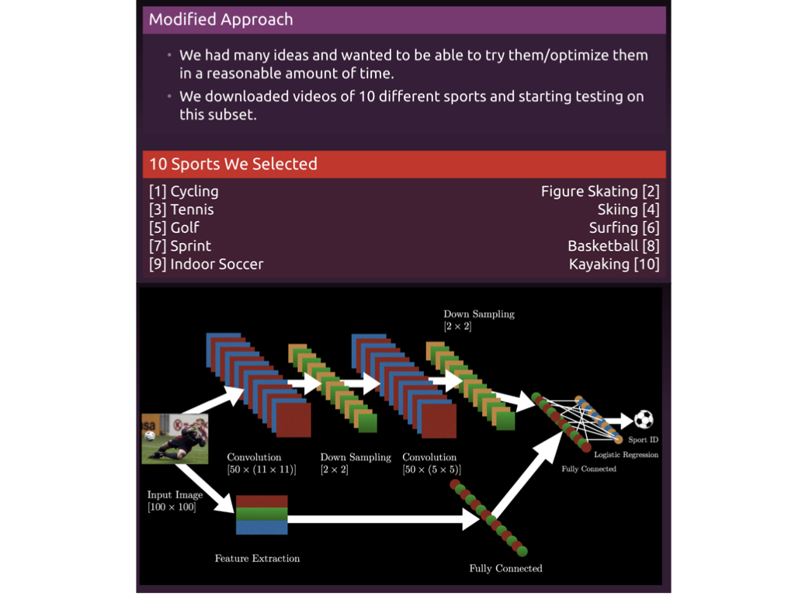
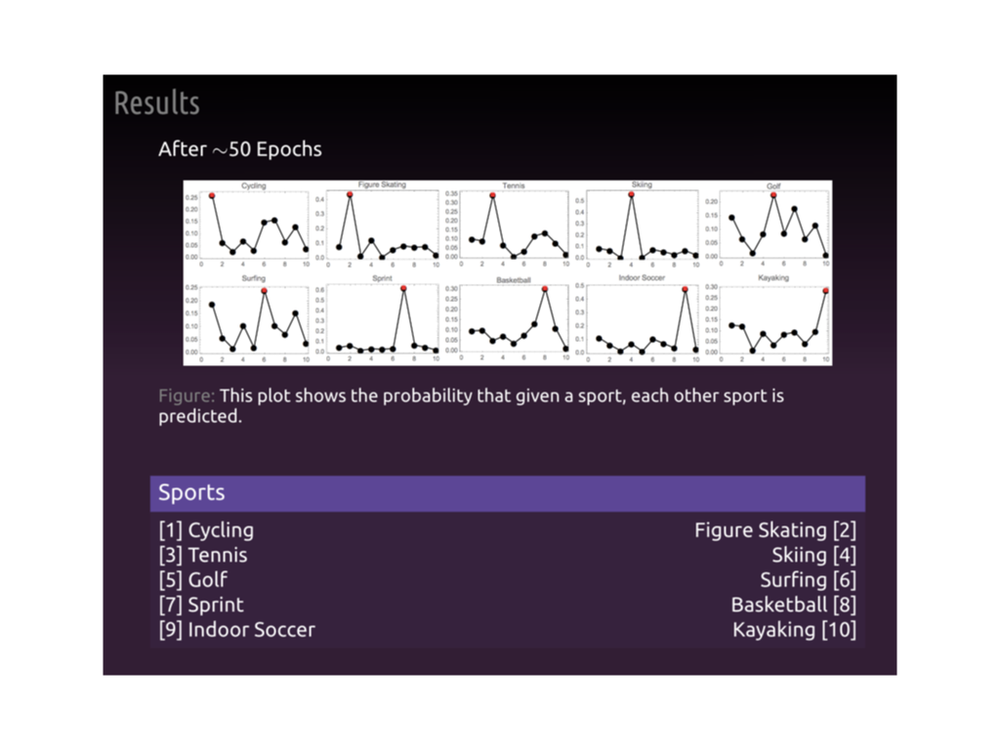
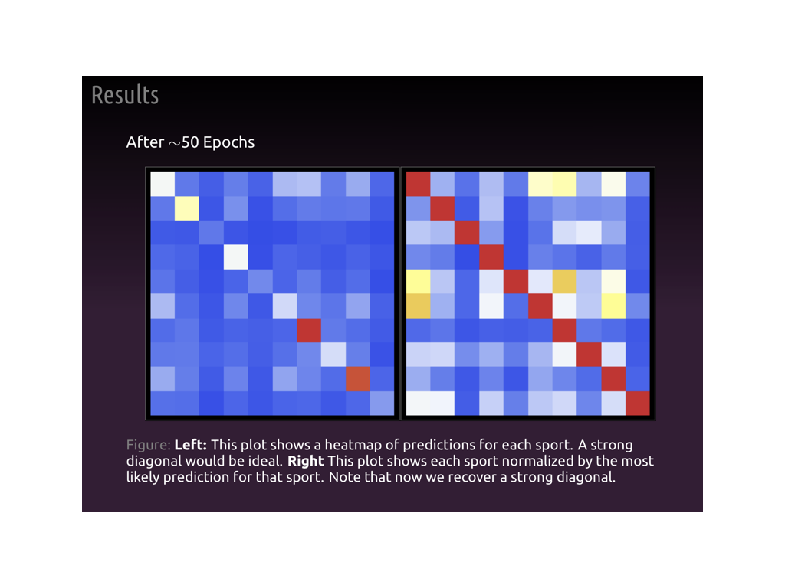
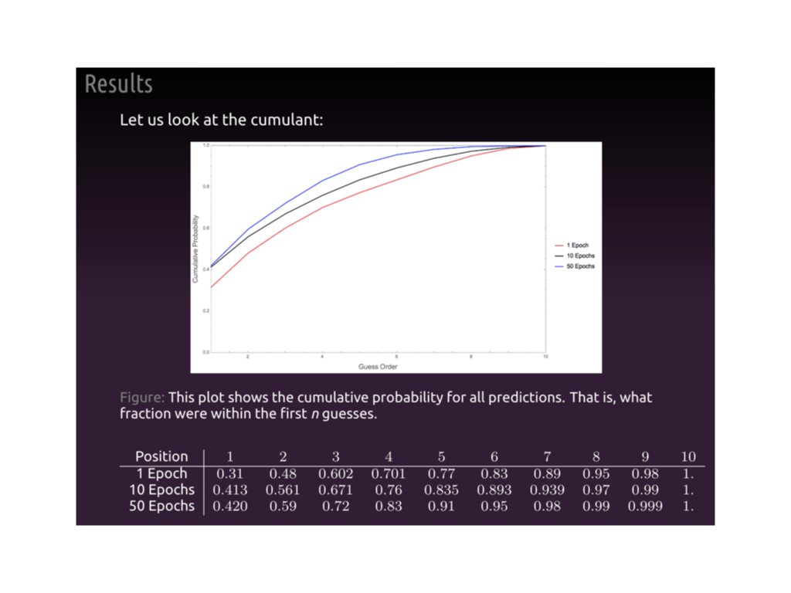
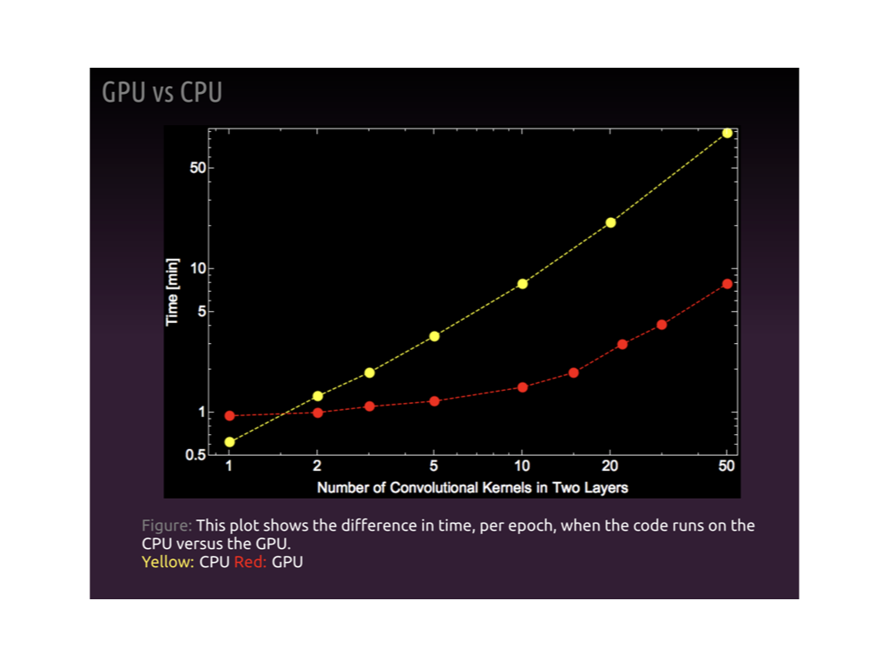
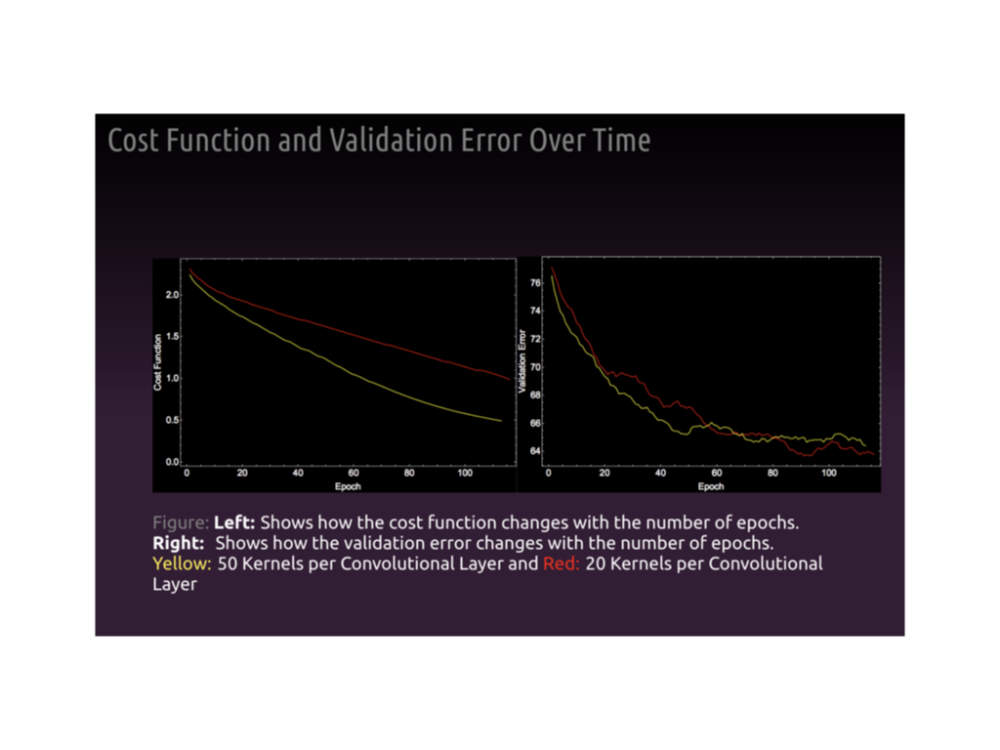

# Sports-1M-Challenge
Implementation of a Sports-1M Challenge video classifier

Code written with Hallvard Moian Nydal at Harvard (Square Starbucks), Spring 2015

The project was inspired by: https://cs.stanford.edu/people/karpathy/deepvideo/

# Running the code
Need to install `Theano`.  We used `youtube-dl` to download videos. We also use `mpi4py` to process the data.

The `Get_Vids_10.py` file should download the sports we used. 
The `find_files_JH_rgb1.py` and similar files use `mpi`  to preprocess the data.
The `ConvolutionalNetworksBW_GPU_10_RUNSET_RGB_1/2.py` files run the main code. The other files are all read in.

# Slides
For the final project in the course, we had to show some slides. I included a selection of them below. _Note_ At some point, I should update these slides. They are from Spring 2015, and I think my aesthetic has improve a bit since then. :)_

Because we were running on a desktop workstation, we used 10 videos rather than the entire original dataset. We downloaded approximately 500-1000 of each class. Our network used a set of input images as well as side stream of average properties. 

After training for ~50 epochs, we got rather good performance. We averaged over the test set to show what was predicted. In all cases, the top guess was the correct category. Skiing and Spring where the best, and the network has the most trouble with surfing and golf.

After 1, 10, and 50 epochs we looked at the performance. After each epoch, we plotted the cumulative probability of being within the first _N_ guesses.

We did a few benchmarking results below, comparing CPU vs GPU training. 

